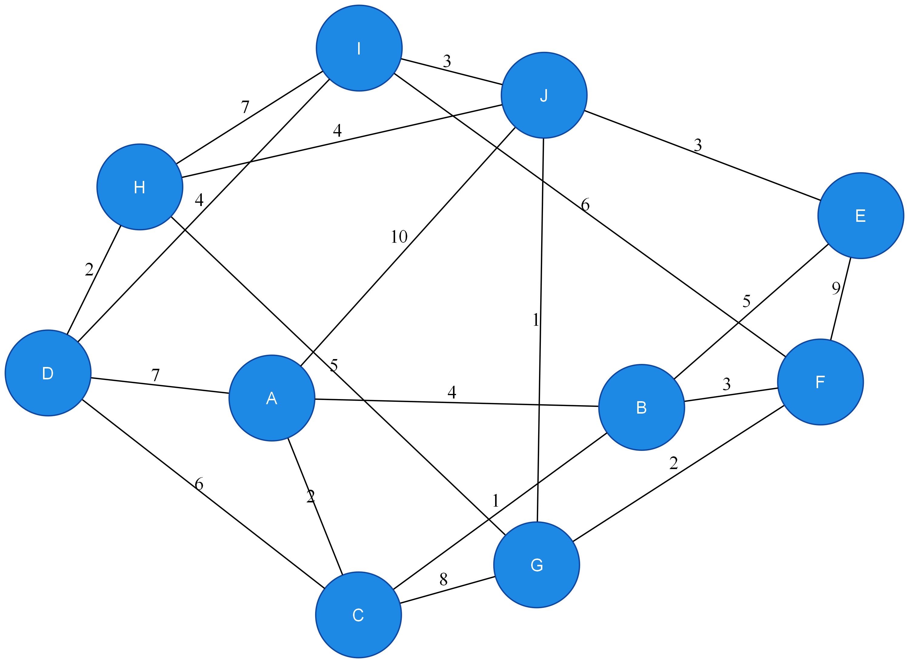
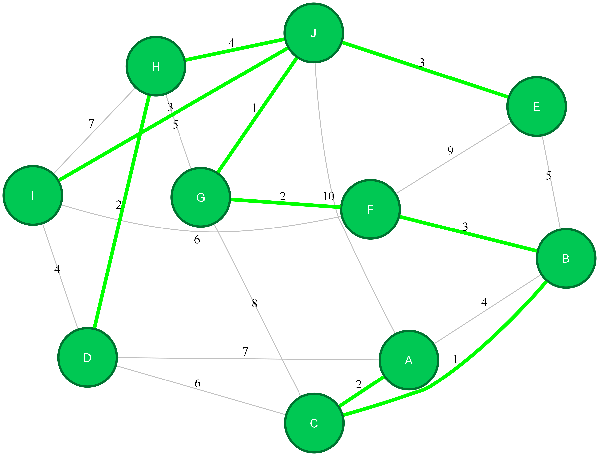

# Graph Algorithms Library

A Java/Kotlin graph library featuring classic algorithms (MST, SSSP, topological sort), an interactive shell, Graphviz visualization, and a benchmarking suite — all wired together with a custom dependency injection container.

---

## Features

**Graph core (`graph` package)**
- Generic, type-safe `Graph<VD, ED>` supporting directed and undirected graphs
- Prim's and Kruskal's MST on undirected graphs
- Dijkstra's SSSP on weighted directed/undirected graphs
- DAG shortest path via topological sort (linear time)
- Topological sort (recursive DFS + iterative DFS variant)
- `DisjointSet` (union-find with union by rank and path compression) for Kruskal's

**GShell (`gshell` package)**  
An interactive REPL for building and querying graphs by hand. The shell runs a Tokenizer → Parser pipeline that produces an AST evaluated against a live graph environment.

**Visualization (`gshell.DotMapper` — Kotlin)**  
Generates Graphviz `.dot` files and renders them to PNG via a spawned `dot` process. MST edges and vertices are highlighted in green with a heavier pen width. Output files are named `{identifier}_{algorithm}_{timestamp}.png` to avoid collisions across runs.

**Benchmarking (`benchmark` package)**  
A reproducible benchmark harness that runs algorithms over multiple graph sizes and topologies (sparse, dense, complete, DAG) and exports results to CSV for downstream analysis.

---

## Architecture

```
io.github.youssefrashidy
├── graph/
│   ├── Graph.java              # Core graph: adjacency list, algorithm implementations
│   ├── Vertex.java / Edge.java # Generic vertex and edge types
│   ├── GraphType.java          # DIRECTED / UNDIRECTED enum
│   ├── augumentingDS/
│   │   └── DisjointSet.java    # Union-find (used by Kruskal's)
│   └── exceptions/             # CycleDetectionException, EdgeMismatchException, …
├── gshell/
│   ├── GShell.java             # REPL loop
│   ├── Tokenizer.java          # Lexer
│   ├── Parser.java             # Recursive-descent parser → AST nodes
│   ├── DotMapper.kt            # Kotlin: graph → Graphviz DOT string + MST overlay
│   ├── nodes/                  # NewNode (graph creation), CommandNode (operations)
│   └── tokens/                 # Token hierarchy (CommandToken, IdentifierToken, …)
├── benchmark/
│   ├── BenchmarkOrchestrator.java  # Composes runs across sizes and topologies
│   ├── BenchmarkRunner.java        # Executes and times a single algorithm run
│   ├── GraphGenerator.java         # Generates sparse / dense / complete / DAG graphs
│   ├── GraphBuilder.java           # Translates raw edge lists into Graph objects
│   ├── FeatureExtractor.java       # Flattens results into feature rows for CSV
│   ├── CSVExporter.java            # Writes feature rows to CSV
│   └── model/                      # Result records: MSTComparison, SSSPComparison, …
└── Main.java                   # Entry point: menu → GShell or benchmark runner
```

> The project uses a custom DI container (Mini-DI) via `@Component` / `@Inject` annotations. `BenchmarkOrchestrator`, `BenchmarkRunner`, `GraphGenerator`, and `GraphBuilder` are all managed beans resolved at startup.

---

## GShell

GShell is an interactive REPL for building and querying graphs. On startup it prints a welcome banner and a command reference. Type `exit` or `quit` to leave.

```
██████╗ ███████╗██╗  ██╗███████╗██╗     ██╗
██╔════╝██╔════╝██║  ██║██╔════╝██║     ██║
██║  ███╗███████╗███████║█████╗  ██║     ██║
██║   ██║╚════██║██╔══██║██╔══╝  ██║     ██║
╚██████╔╝███████║██║  ██║███████╗███████╗███████╗
 ╚═════╝ ╚══════╝╚═╝  ╚═╝╚══════╝╚══════╝╚══════╝

  Graph Shell  —  interactive graph algorithm environment
  Type 'exit' or 'quit' to leave.

gshell>
```

### Creating a graph

```
Graph <name> = new Graph(Directed)
Graph <name> = new Graph(Undirected)
```

### Graph operations

| Command | Arguments | Description |
|---|---|---|
| `<g>.addVertex("v")` | vertex name | Add a single vertex |
| `<g>.addVertices("a", "b", …)` | one or more names | Add multiple vertices |
| `<g>.addEdge("u", "v", weight)` | source, dest, int weight | Add one edge |
| `<g>.addEdges("u1","v1",w1, …)` | triples | Add multiple edges at once |
| `<g>.primMST()` | — | Compute and print Prim's MST |
| `<g>.kruskalMST()` | — | Compute and print Kruskal's MST |
| `<g>.dijkstra("src")` | source vertex name | Print shortest distances from source |
| `<g>.dagShortestPath("src")` | source vertex name | DAG shortest path (directed graphs only) |
| `<g>.visualizeGraph()` | — | Render graph to PNG via Graphviz |
| `<g>.visualizePrimMST()` | — | Render graph with Prim's MST highlighted |
| `<g>.visualizeKruskalMST()` | — | Render graph with Kruskal's MST highlighted |

### Example session

```
gshell> Graph g = new Graph(Undirected)
gshell> g.addVertices("A", "B", "C", "D")
gshell> g.addEdges("A", "B", 4, "A", "C", 2, "B", "D", 5, "C", "D", 1)
gshell> g.kruskalMST()
[C-D(1), A-C(2), A-B(4)]
gshell> g.visualizeKruskalMST()
```

### Visualization output

Visualization commands render the graph to a PNG file named `{identifier}_{algorithm}_{timestamp}.png` and open it automatically. MST edges are drawn in green with a heavier stroke; vertices that belong to the MST are filled green, while non-MST vertices retain the default blue fill.

**Plain graph (`visualizeGraph`)**



**Prim's MST (`visualizePrimMST`)**



---

## Benchmarks

The main menu exposes four benchmark modes. Each run collects timing data over 20 iterations after 10 warm-up rounds and exports results to CSV. A `System.gc()` call followed by a 100 ms sleep separates each run to reduce GC interference.

| Option | What it benchmarks | Graph sizes |
|---|---|---|
| MST benchmark | Prim vs Kruskal on sparse, dense, complete graphs | 1 000 · 2 500 · 5 000 · 10 000 |
| Dijkstra benchmark | Dijkstra on sparse, dense, DAG, complete graphs | same |
| SSSP-DAG benchmark | Dijkstra vs DAG-SP on DAGs | same |
| All benchmarks | All of the above, three CSV files | same |

Complete graphs are capped at 5 000 vertices to avoid generating graphs with tens of millions of edges.

### Prim vs Kruskal MST (ms)

| Distribution | V | Prim Mean | Prim Median | Prim Std | Kruskal Mean | Kruskal Median | Kruskal Std | Speedup (K/P) |
|---|---|---|---|---|---|---|---|---|
| SPARSE | 1 000 | 0.952 | 0.888 | 0.111 | 1.630 | 1.518 | 0.297 | 1.74× |
| SPARSE | 2 500 | 2.556 | 2.463 | 0.179 | 4.495 | 4.215 | 1.116 | 1.74× |
| SPARSE | 5 000 | 6.337 | 6.019 | 0.365 | 9.906 | 9.231 | 1.460 | 1.56× |
| SPARSE | 10 000 | 14.936 | 14.858 | 0.691 | 20.911 | 21.061 | 0.569 | 1.40× |
| DENSE | 1 000 | 10.959 | 10.794 | 0.376 | 52.753 | 52.361 | 1.695 | 4.82× |
| DENSE | 2 500 | 65.694 | 64.817 | 2.657 | 392.607 | 392.074 | 7.190 | 6.03× |
| DENSE | 5 000 | 139.170 | 139.797 | 2.386 | 1 556.470 | 1 545.460 | 35.946 | 11.12× |
| DENSE | 10 000 | 646.718 | 616.126 | 34.225 | 6 688.575 | 6 321.414 | 431.581 | 10.35× |
| COMPLETE | 1 000 | 33.068 | 33.264 | 0.748 | 250.144 | 250.519 | 3.384 | 7.56× |
| COMPLETE | 2 500 | 115.144 | 111.937 | 6.747 | 1 553.708 | 1 536.070 | 55.252 | 13.75× |
| COMPLETE | 5 000 | 504.216 | 509.745 | 10.778 | 6 271.410 | 6 147.918 | 303.422 | 12.35× |

**Key takeaway:** Prim's (lazy deletion with a binary heap) consistently dominates Kruskal's on dense and complete graphs. The advantage widens dramatically with edge density — reaching a 13.7× speedup on complete graphs at V=2 500 — because Kruskal's must sort all edges (O(E log E)) before union-find operations, and E grows as O(V²) on dense inputs. On sparse graphs the gap narrows to ~1.7×, since E ≈ O(V) and the sort is cheap.

### Dijkstra SSSP (ms)

| Distribution | V | Mean | Median | Std |
|---|---|---|---|---|
| SPARSE | 1 000 | 0.572 | 0.539 | 0.081 |
| SPARSE | 2 500 | 1.631 | 1.590 | 0.151 |
| SPARSE | 5 000 | 3.982 | 3.875 | 0.262 |
| SPARSE | 10 000 | 11.404 | 10.125 | 1.345 |
| DAG | 1 000 | 0.322 | 0.299 | 0.055 |
| DAG | 2 500 | 0.834 | 0.816 | 0.061 |
| DAG | 5 000 | 1.794 | 1.748 | 0.100 |
| DAG | 10 000 | 4.450 | 4.410 | 0.218 |
| DENSE | 1 000 | 7.483 | 7.277 | 0.512 |
| DENSE | 2 500 | 44.561 | 43.543 | 2.527 |
| DENSE | 5 000 | 76.215 | 76.365 | 1.741 |
| DENSE | 10 000 | 339.956 | 340.839 | 6.859 |
| COMPLETE | 1 000 | 25.419 | 25.194 | 0.788 |
| COMPLETE | 2 500 | 75.152 | 69.725 | 1.396 |
| COMPLETE | 5 000 | 322.643 | 322.049 | 5.895 |

### Dijkstra vs DAG Shortest Path on DAG graphs (ms)

| V | Dijkstra Mean | Dijkstra Median | Dijkstra Std | DAG SP Mean | DAG SP Median | DAG SP Std | Speedup (Dijk/DAG) |
|---|---|---|---|---|---|---|---|
| 1 000 | 0.297 | 0.288 | 0.024 | 0.428 | 0.416 | 0.029 | 0.69× |
| 2 500 | 0.858 | 0.818 | 0.087 | 1.147 | 1.115 | 0.082 | 0.75× |
| 5 000 | 1.819 | 1.786 | 0.096 | 2.394 | 2.354 | 0.115 | 0.76× |
| 10 000 | 4.431 | 4.431 | 0.137 | 5.482 | 5.376 | 0.190 | 0.81× |

**Key takeaway:** Dijkstra is faster than the topological-sort DAG shortest path on all measured sizes. The DAG path carries the overhead of a full DFS topological sort before the relaxation pass, while Dijkstra's lazy priority queue pays only for the vertices it actually reaches. The gap narrows slightly as V grows (0.69× → 0.81×), suggesting the constant-factor difference shrinks as the relaxation pass dominates.

---

## Data Structures

### Graph representation

The core `Graph<VD, ED>` maintains three parallel structures:

**Adjacency list** — `IntObjectHashMap<MutableList<Edge<ED>>>`  
Maps each vertex id (primitive `int`) to a `FastList` of outgoing edges. Using Eclipse Collections' primitive-keyed map avoids boxing vertex ids to `Integer` on every lookup, which matters at sizes of 10 000+ vertices and dense edge sets. For undirected graphs, every logical edge is decomposed into two directed half-edges — one stored under each endpoint — so adjacency traversal is symmetric without any extra branching in the algorithm.

**Edge list** — `FastList<Edge<ED>>`  
A flat list of every *unique* edge, regardless of direction. Kruskal's needs to sort all edges by weight without touching the adjacency list; having this as a separate list means `kruskalMST()` can call `toSortedList()` on it and leave the adjacency list untouched. It also serves as the canonical source for Graphviz export.

**Vertex map** — `IntObjectHashMap<Vertex<VD>>`  
Provides O(1) vertex lookup by id for formatting output and resolving source vertices in SSSP calls.

---

### Vertex and Edge

`Vertex<D>` is a thin wrapper around a monotonically assigned `int id` and a generic payload `D`. Vertices are always referenced by their id inside algorithm code, keeping all hot-path maps primitive.

`Edge<D>` stores `u`, `v`, `id`, and `weight` as plain `int` fields. Equality and hashing are defined solely on `id`, which makes Kruskal's MST set membership check (`edge in mstSet`) work correctly even for undirected half-edges — both half-edges of the same logical edge share the same `id`.

---

### Priority queue (Prim's and Dijkstra's)

Both algorithms use `java.util.PriorityQueue<QueueEntry>` ordered by the `key` field (edge weight for Prim's, tentative distance for Dijkstra's). Rather than implementing a decrease-key operation, the code uses a **lazy deletion** pattern: stale entries are left in the queue and discarded when popped by checking the `inMST` / `foundShortestPath` boolean maps. This trades some extra memory for a simpler implementation with no handle bookkeeping.

---

### Union-Find (`DisjointSet`)

Used exclusively by Kruskal's MST. Backed by two `IntIntHashMap`s — `parent` and `rank` — both primitive to avoid boxing. Implements:

- **Union by rank** — the tree of lower rank is always attached under the tree of higher rank, keeping trees shallow.
- **Path compression** (`findSet`) — on each call the chain of ancestors is flattened to point directly at the root, so subsequent finds on the same element are O(1). Together these give an amortised O(α(n)) per operation.

---

### Topological sort stack

`topologicalSort()` returns an `IntArrayStack` (Eclipse Collections primitive stack). Vertices are pushed in post-order during DFS, so popping the stack yields topological order. The same stack is consumed immediately by `dagShortestPath()` without materialising the full ordering into a list.

A gray/black distinction for cycle detection is maintained via two `IntHashSet`s (`visited` and `onStack`). If a vertex on the current DFS stack is encountered again, a `CycleDetectionException` is thrown immediately.

An iterative DFS variant (`dfsIterative`) is also implemented using an explicit `Deque<DFSFrame>`, avoiding stack-overflow risk on graphs with very deep chains. It is not yet wired into the public API but is present as a drop-in replacement.

---

### Benchmark timing

`BenchmarkRunner` times each algorithm with `System.nanoTime()` over **20 iterations** after **10 warm-up rounds** (allowing the JIT to compile the hot path before measurements begin). A `System.gc()` call followed by a 100 ms sleep separates each run to reduce GC interference between measurements. Raw `long[]` timing arrays are passed to `FeatureExtractor` for aggregation.

---

## Dependencies

| Library | Purpose |
|---|---|
| Eclipse Collections | Primitive maps/lists (`IntObjectHashMap`, `IntIntHashMap`, `FastList`, …) throughout the graph and benchmark code |
| Kotlin stdlib | `DotMapper` visualization helper |
| Graphviz (`dot`) | External process for PNG rendering — must be installed and on `PATH` |
| Mini-DI (internal) | `@Component` / `@Inject` DI container used to wire benchmark beans |

---

## Building and Running

```bash
# Build
mvn package

# Run
mvn exec:java -Dexec.mainClass="io.github.youssefrashidy.Main"
```

On startup the application bootstraps the DI container, scanning the `benchmark`, `graph`, and `gshell` packages, then presents the main menu.

**Visualization prerequisite:** Install [Graphviz](https://graphviz.org/download/) and ensure `dot` is on your system `PATH`. The shell currently opens the rendered PNG via `cmd /c start` (Windows). On Linux/macOS, update the `ProcessBuilder` call in `CommandNode` accordingly.

---

## Testing

JUnit tests live under `src/test/java`:

- `GraphTest` — correctness tests for MST, Dijkstra, DAG shortest path, topological sort, and edge type enforcement
- `GraphGeneratorTest` — validates generated graph topology (connectivity, acyclicity for DAGs, edge density)
- `DisjointSetTest` — union-find correctness (union by rank, path compression)
